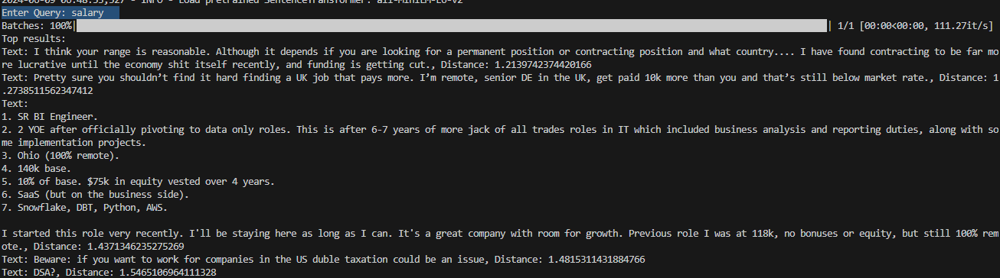

# Reddit Data Retrieval, Embedding, and Analysis

This project retrieves recent posts and comments from a specified subreddit, generates embeddings using Sentence Transformers, clusters the embeddings, and allows for similarity search using FAISS.

## Table of Contents
- [Installation](#installation)
- [Overview](#overview)
- [Usage](#usage)

## Installation

1. Clone the repository:
    ```bash
    git clone https://github.com/username/repo-name.git
    cd repo-name
    ```

2. Install the required packages:
    ```bash
    pip install -r requirements.txt
    ```

### Overview

1. **Reprocessing Data**:
    * The script will prompt you to decide whether to reprocess posts and comments.
    * If you choose **yes**:
        * It will clear the contents of the input, embed, and output directories.
        * It will then retrieve recent posts and comments from the specified subreddit and generate embeddings.
        * Embeddings will be clustered and analyzed, and the FAISS index will be built.

2. **Using Existing Data**:
    * If you choose **no**:
        * The script will check for existing embeddings and FAISS index.
        * If found, it will load the FAISS index and perform the clustering and analysis.
        * If not found, it will prompt you to reprocess the data.

3. **Performing Similarity Search**:
    * The script will prompt you to enter a query text.
    * It will generate the embedding for the query and perform a similarity search using FAISS.
    * Top k similar posts/comments will be displayed along with their distances.
    * The results will be saved to the output directory with a timestamp.

**Semantic Search Example**:


## Usage

Update the variables in `main.py` as desired:
* `HOURS = 24` - Number of hours to look back for retrieving posts and comments.
* `SUBREDDIT = 'dataengineering'` - Subreddit to retrieve posts and comments from.
* `TOP_N_TERMS = 100` - Number of top terms to consider in the analysis.
* `TOP_K_MATCHES = 5` - Number of top similar posts/comments to return in the search.
* `EMBEDDING_MODEL = 'all-MiniLM-L6-v2'` - The embedding model used for generating embeddings.

To run the entire process, simply execute the main script:

```bash
python main.py
```
